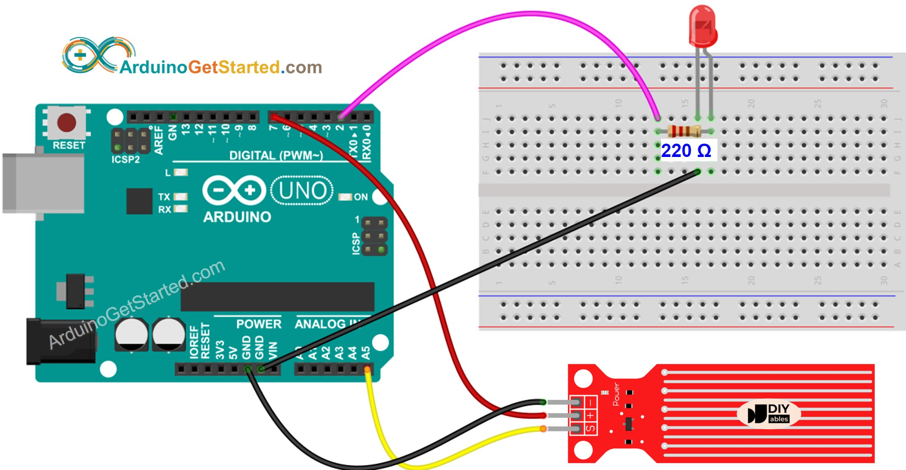

# Water Detection System Using Arduino

This project demonstrates a simple water detection system using an Arduino board
and a water sensor. 

The system uses an LED to indicate whether water is detected. 

The LED turns ON when no water is detected and turns OFF when water is present.

---

## Features

- Detects water presence using a water sensor.
- LED indication for water detection status:
  - `ON`: No water detected.
  - `OFF`: Water detected.
- Serial output to monitor sensor readings and water status.

---

## Components Required

- Arduino Board (e.g., Arduino Uno, Nano, or Mega)
- Water Sensor
- LED (with a suitable resistor, e.g., 220Ω)
- Connecting Wires
- Breadboard (optional, for prototyping)

---

## Circuit Diagram

### Schematics



---

### Pin Connections

| Arduino Pin | Component           | Description                         |
| ----------- | ------------------- | ----------------------------------- |
| `D2`          | LED (via resistor)  | Turns ON/OFF based on water status. |
| `D7`          | Water Sensor Power  | Powers the water sensor.            |
| `A5`          | Water Sensor Signal | Reads the sensor's analog output.   |

---

## Code Overview

### Main Features

1. Powers the water sensor only when needed to conserve energy.
2. Reads and averages multiple sensor readings for improved accuracy.
3. Uses a threshold value to determine water presence.

### Code Snippet

```c
#define LED_PIN     2
#define POWER_PIN   7
#define SIGNAL_PIN  A5
#define THRESHOLD   300
```

- `LED_PIN`: Controls the LED.
- `POWER_PIN`: Powers the water sensor.
- `SIGNAL_PIN`: Reads analog values from the water sensor.
- `THRESHOLD`: Determines water presence (adjust as needed).

---

## Installation and Setup

1. Connect the Components:
  - Follow the circuit diagram to connect the water sensor, LED, and Arduino.
2. Upload the Code:
  - Open the Arduino IDE.
  - Copy and paste the provided code into the IDE.
  - Select the appropriate board and port.
  - Upload the code to the Arduino board.
3. Adjust Threshold (if necessary):
  - Observe the sensor's output in the Serial Monitor.
  - Update the `THRESHOLD` value in the code to match your environment.

## Usage

1. Power the Arduino using a USB cable or external power source.
2. Observe the LED:
  - `ON`: No water detected.
  - `OFF`: Water detected.
3. Open the Serial Monitor in the Arduino IDE (set to 9600 baud) to view the water detection status and sensor readings.

## Customization

Threshold Value: Adjust THRESHOLD to match the sensor's behavior in your specific setup.

LED Behavior: Modify the LED logic for different indications if needed.

Sampling Rate: Change the delay between readings by editing LOOP_DELAY.

## Troubleshooting

LED not responding:
    Check connections to the LED and resistor.
    Ensure the water sensor is powered properly.

Incorrect readings:
    Verify the sensor is connected securely.
    Adjust the THRESHOLD based on the sensor's output.

## Future Enhancements

Add a buzzer for audible alerts.
Integrate with an IoT platform for remote monitoring.
Use a display to show real-time sensor readings.

---

## Tutorial

[Arduino Water Level Sensor](https://arduinogetstarted.com/tutorials/arduino-water-sensor)

---
